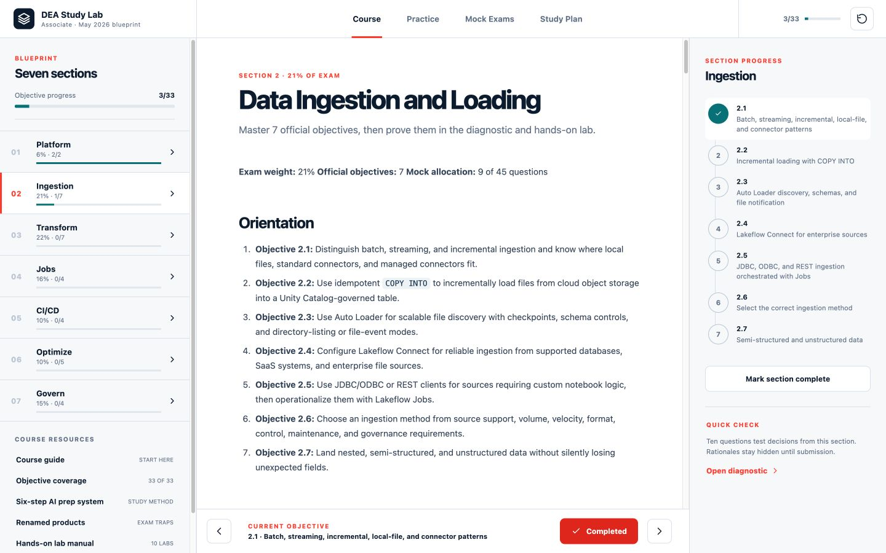
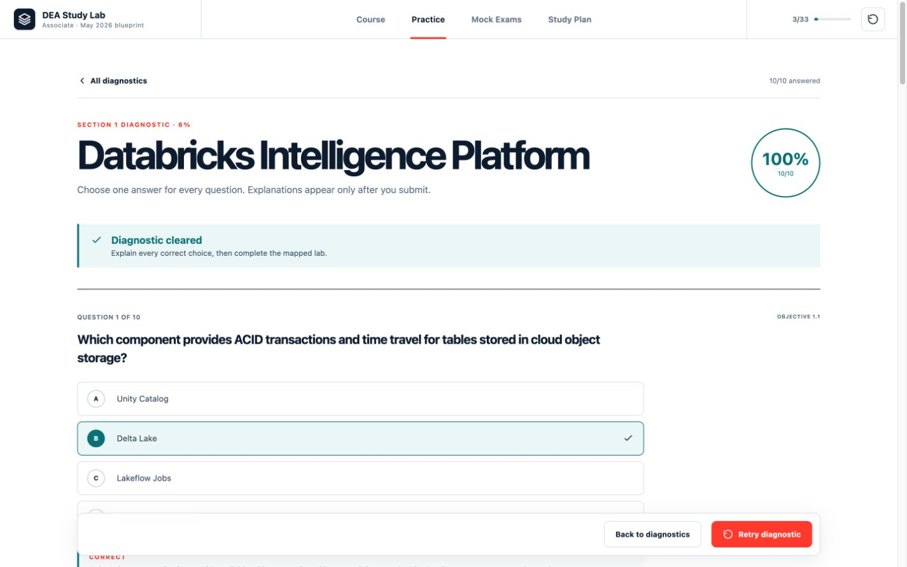
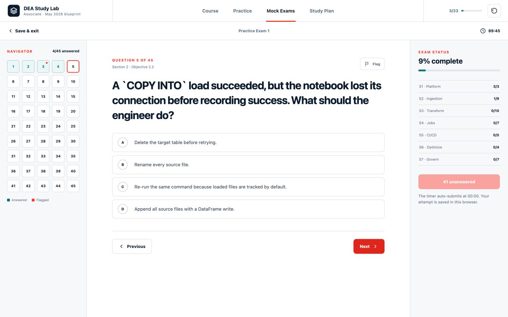
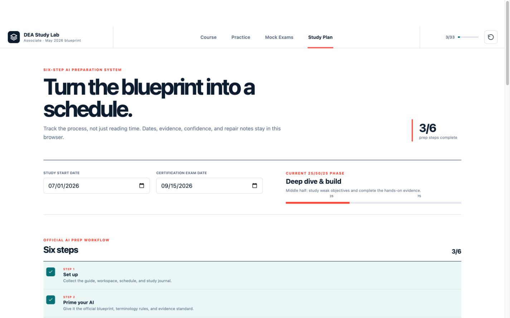
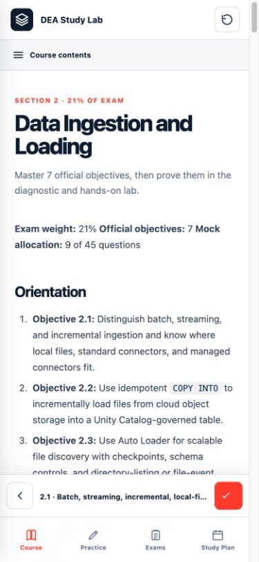

<div align="center">

# Databricks Data Engineer Associate Study Lab

**A complete, open-source study course and interactive exam-preparation app for the Databricks Certified Data Engineer Associate certification.**

[](https://github.com/felipe-cosse/Databricks-Certified-Data-Engineer-Associate/actions/workflows/ci.yml)


[Explore the course](content/course/guides/course-guide.md) ·
[Review objective coverage](content/course/guides/objective-coverage.md) ·
[Open the lab manual](content/course/labs/hands-on-labs.md) ·
[Contribute](CONTRIBUTING.md)

</div>



> [!IMPORTANT]
> This is an independent community learning project. It is not affiliated with, endorsed by, or maintained by Databricks. The practice questions are original exam-style questions—not leaked, recalled, or copied certification items.

## Why this project exists

The official blueprint is compact; preparing well requires more than memorizing product names. This project turns every published objective into:

- A plain-English orientation
- Current terminology and product-renaming guidance
- Decision frameworks and common exam traps
- Runnable SQL and PySpark examples
- A hands-on task with evidence requirements
- A closed-note diagnostic with answer rationales
- Timed practice and an objective-level repair loop

The Markdown curriculum is the source of truth. The React application imports those files directly, so the website and written course stay aligned.

## What is included

| Resource | Included |
|---|---:|
| Official exam sections | 7 of 7 |
| Published objectives | 33 of 33 |
| Section diagnostics | 7 × 10 questions |
| Hands-on labs | 10 |
| Full mock exams | 3 × 45 questions |
| Original practice questions | 205 |
| AI Prep Guide steps | 6 of 6 |
| Course and exam prose | 30,000+ words |

The mock exams follow the published **45 scored questions / 90 minutes** format and use a rounded 45-question distribution that preserves the official section weighting.

## Application preview

### Section diagnostics

Answer explanations remain hidden until submission. Results identify the mapped objective and provide a repair path.



### Timed mock exams

Each mock includes a 90-minute countdown, 45-question navigator, flags, section status, autosave, resume support, scoring, and answer review.



### Six-step study planner

The planner implements the official AI preparation workflow, calculates the current 25/50/25 study phase, and tracks confidence, labs, terminology, and repair notes.



<div align="center">

### Responsive mobile course



</div>

## Exam blueprint coverage

| Section | Weight | Objectives | Questions per mock |
|---|---:|---:|---:|
| Databricks Intelligence Platform | 6% | 2 | 3 |
| Data Ingestion and Loading | 21% | 7 | 9 |
| Data Transformation and Modeling | 22% | 7 | 10 |
| Working with Lakeflow Jobs | 16% | 4 | 7 |
| Implementing CI/CD | 10% | 4 | 5 |
| Troubleshooting, Monitoring, and Optimization | 10% | 5 | 4 |
| Governance and Security | 15% | 4 | 7 |
| **Total** | **100%** | **33** | **45** |

See the [complete objective-to-lesson map](content/course/guides/objective-coverage.md).

## Six-step preparation workflow

The course implements every step in the June 2026 AI Prep Guide:

1. **Set up** — collect the blueprint, workspace, schedule, and journal.
2. **Prime your AI** — provide current scope, terminology, and evidence rules.
3. **Track renamed products** — detect stale names and legacy behavior.
4. **Run the learning loop** — orient, diagnose, deep-dive, practice, and repair.
5. **Complete the hands-on minimum** — produce evidence in a Databricks workspace.
6. **Use 25/50/25 pacing** — diagnose first, build in the middle, finish with timed practice and repair.

Read the complete [AI Preparation System](content/course/guides/ai-prep-system.md).

## Getting started

### Prerequisites

- Node.js `20.19+` or `22.12+`
- npm
- A modern browser
- Optional: Databricks Free Edition, trial, or workspace access for the labs

### Run locally

```bash
git clone https://github.com/felipe-cosse/Databricks-Certified-Data-Engineer-Associate.git
cd Databricks-Certified-Data-Engineer-Associate
npm ci
npm run dev
```

Open the local URL printed by Vite.

### Test and build

```bash
npm test
npm run build
```

The production build is written to `dist/` and can be deployed to any static hosting provider.

### Run with Docker

Build and start the production Nginx container:

```bash
make docker-up
```

Open [http://localhost:8080](http://localhost:8080), then verify the container:

```bash
make health
make docker-ps
```

Stop it with:

```bash
make docker-down
```

To use another host port:

```bash
APP_PORT=9090 make docker-up
```

The image uses a multi-stage Node.js build and an unprivileged Nginx runtime. Compose adds a read-only filesystem, dropped Linux capabilities, `no-new-privileges`, a health check, and temporary writable mounts only where Nginx requires them.

### Makefile commands

Run `make help` to see the full command list.

| Command | Purpose |
|---|---|
| `make install` | Install exact npm dependencies |
| `make dev` | Start the Vite development server |
| `make verify` | Run tests and the production build |
| `make docker-config` | Validate the Compose configuration |
| `make docker-build` | Build the production image |
| `make docker-up` | Build and start the site |
| `make docker-logs` | Follow Nginx container logs |
| `make docker-shell` | Open a shell in the running container |
| `make health` | Check `/healthz` |
| `make docker-down` | Stop and remove the Compose service |

## Recommended study sequence

1. Read the [Course Guide](content/course/guides/course-guide.md).
2. Take all seven diagnostics closed-note.
3. Rank missed objectives by diagnostic score and exam weight.
4. Study the weakest high-weight objectives first.
5. Complete the mapped labs and record evidence.
6. Re-answer missed questions in your own words.
7. Take a timed mock only after every objective has evidence.
8. Use the scorecard to repair the exact misconception behind each miss.

## Course library

| Section | Lesson |
|---|---|
| Start here | [Course Guide](content/course/guides/course-guide.md) |
| Coverage | [Official Objective Coverage Map](content/course/guides/objective-coverage.md) |
| Study method | [Six-Step AI Preparation System](content/course/guides/ai-prep-system.md) |
| Terminology | [Renamed Products and Legacy Traps](content/course/guides/renamed-products.md) |
| Section 1 | [Databricks Intelligence Platform](content/course/sections/01-databricks-intelligence-platform.md) |
| Section 2 | [Data Ingestion and Loading](content/course/sections/02-data-ingestion-and-loading.md) |
| Section 3 | [Data Transformation and Modeling](content/course/sections/03-data-transformation-and-modeling.md) |
| Section 4 | [Working with Lakeflow Jobs](content/course/sections/04-working-with-lakeflow-jobs.md) |
| Section 5 | [Implementing CI/CD](content/course/sections/05-implementing-cicd.md) |
| Section 6 | [Troubleshooting, Monitoring, and Optimization](content/course/sections/06-troubleshooting-monitoring-optimization.md) |
| Section 7 | [Governance and Security](content/course/sections/07-governance-and-security.md) |
| Practice | [Hands-on Lab Manual](content/course/labs/hands-on-labs.md) |
| Final preparation | [Final Review and Exam Strategy](content/course/guides/final-review.md) |

## Practice exams

- [Practice Exam 1 — Foundation and Selection](content/assessments/practice-exams/practice-exam-1.md)
- [Practice Exam 2 — Operations and Reliability](content/assessments/practice-exams/practice-exam-2.md)
- [Practice Exam 3 — Integration and Transfer](content/assessments/practice-exams/practice-exam-3.md)
- [Scorecard and Repair Log](content/assessments/practice-exams/scorecard.md)

The Markdown exam files contain answer metadata and rationales for maintainers. For realistic practice, use the website, where rationales remain hidden until submission.

## Repository structure

```text
.
├── content/
│   ├── course/
│   │   ├── guides/         # Study system, coverage, terminology, and review
│   │   ├── labs/           # Hands-on project manual
│   │   └── sections/       # Seven exam-blueprint lessons
│   └── assessments/
│       ├── diagnostics/    # Seven section diagnostics
│       └── practice-exams/ # Three 45-question mocks and scorecard
├── docs/
│   ├── design/             # Concepts, design system, and QA references
│   └── screenshots/        # Public README screenshots
├── src/
│   ├── components/          # Shared UI components
│   ├── data/                # Curriculum metadata and Markdown catalog
│   ├── hooks/               # Persistent browser-state hook
│   ├── lib/                 # Question parsing and scoring
│   └── views/               # Course, practice, exams, and plan surfaces
├── tests/                   # Content integrity and scoring tests
├── docker/                  # Production Nginx configuration
├── Dockerfile               # Multi-stage application image
├── docker-compose.yml       # Hardened local production service
├── Makefile                 # Local and container workflows
└── .github/                 # CI and contribution templates
```

## Technical design

- **React 19** and **Vite 7**
- Markdown files imported as raw source content
- Custom Markdown renderer for headings, tables, lists, links, and code
- Question parser driven by explicit objective/answer metadata
- `localStorage` persistence for progress, diagnostics, mock attempts, and the study plan
- No account, analytics service, backend, or remote data storage
- Responsive desktop rails, mobile course drawer, and mobile bottom navigation
- Multi-stage Docker build with an unprivileged Nginx runtime
- Compose health checks, SPA fallback, immutable asset caching, and security headers

## Quality controls

Automated tests verify:

- Seven sections and exactly 33 objectives
- Official section weights totaling 100%
- Ten valid questions in every diagnostic
- 45 complete questions in every mock
- 135 unique mock-exam prompts
- Correct per-section mock distribution
- Deterministic scoring and timer formatting

GitHub Actions runs the test suite and production build for every pull request and push.

## Contributing

Corrections, clearer explanations, accessibility improvements, and new objective-aligned scenarios are welcome. Please read [CONTRIBUTING.md](CONTRIBUTING.md) before opening a pull request.

Content corrections should include a current official Databricks source. Exam dumps, recalled live questions, and copyrighted third-party course material will not be accepted.

## Official sources

- [Databricks Certified Data Engineer Associate](https://www.databricks.com/learn/certification/data-engineer-associate)
- [Data Engineer Associate Exam Guide — effective May 4, 2026](https://www.databricks.com/sites/default/files/2026-03/databricks-certified-data-engineer-associate-exam-guide-may-4-2026.pdf)
- [AI Prep Guide for Any Databricks Certification — June 2026](https://www.databricks.com/sites/default/files/2026-06/ai-prep-guide-any-databricks-certification.pdf)
- [Databricks documentation](https://docs.databricks.com/)
- [Databricks Customer Academy](https://customer-academy.databricks.com/learn)

## Trademark and content notice

Databricks, Delta Lake, Unity Catalog, Lakeflow, and related names are trademarks or registered trademarks of their respective owners. Their use here is descriptive and educational.

Product behavior and certification scope can change. Treat the official exam guide as the scope authority and current Databricks documentation as the technical authority.

## License

Released under the [MIT License](LICENSE).
